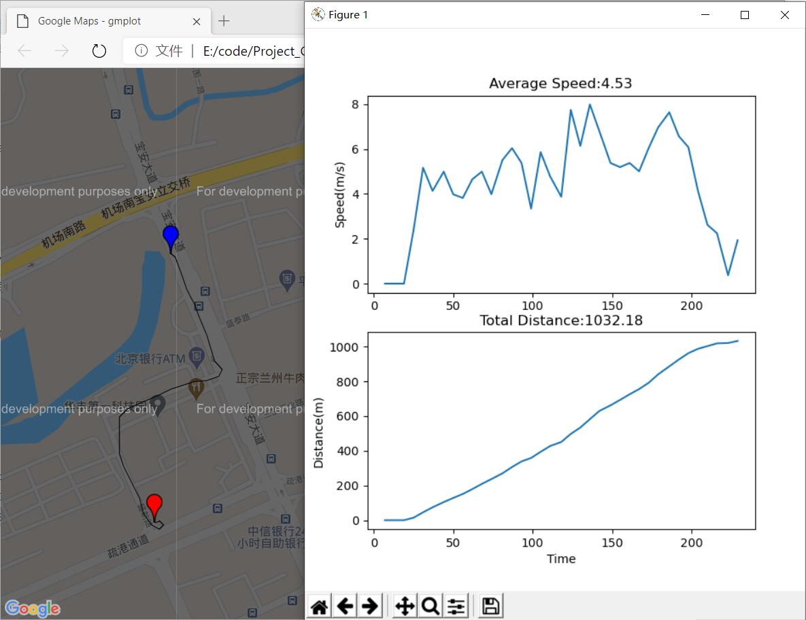
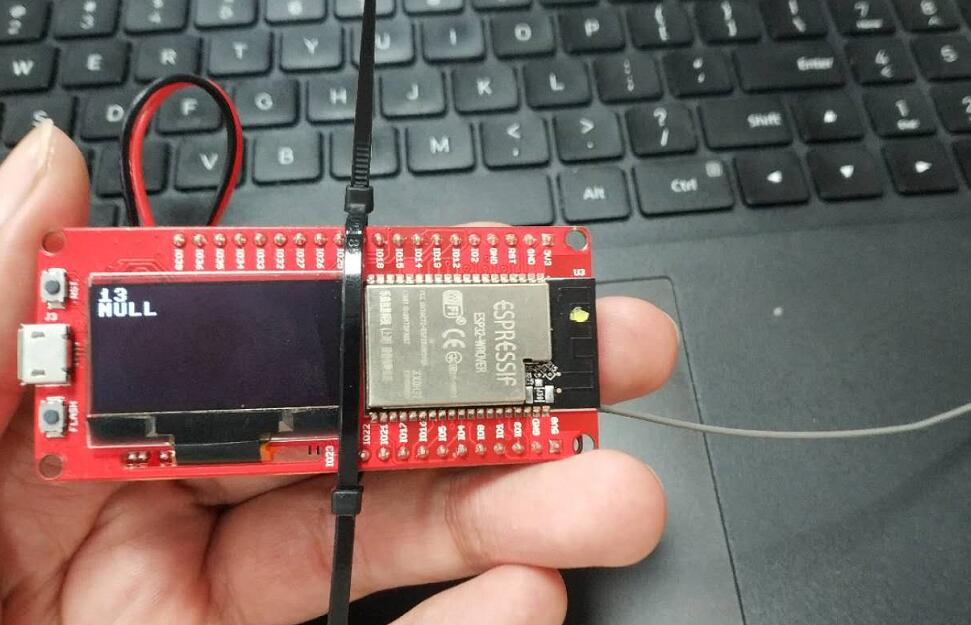
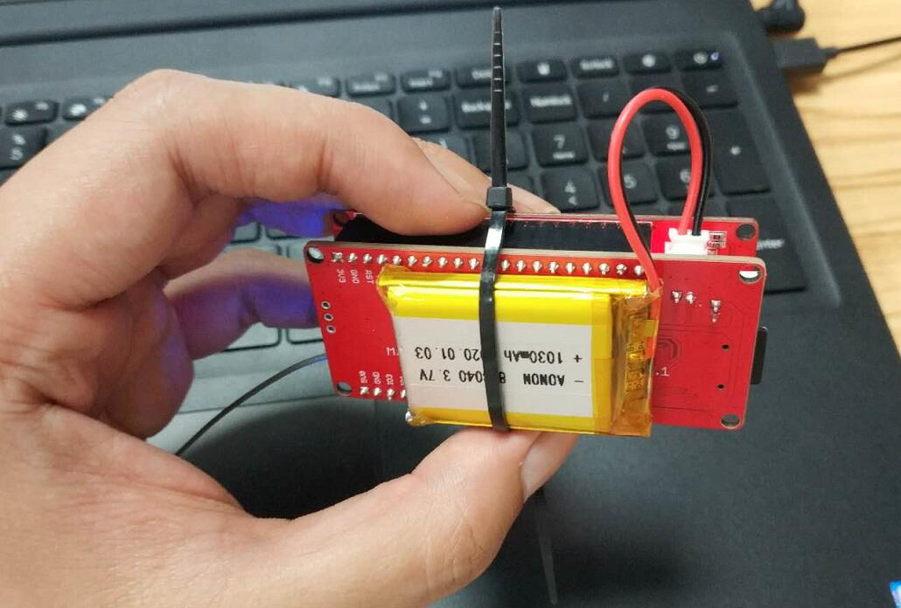
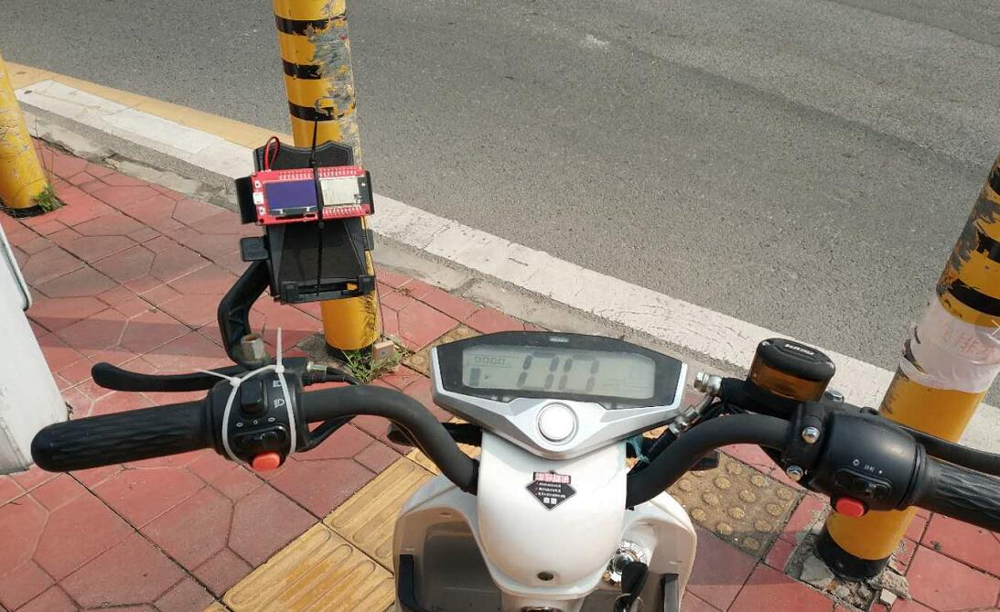
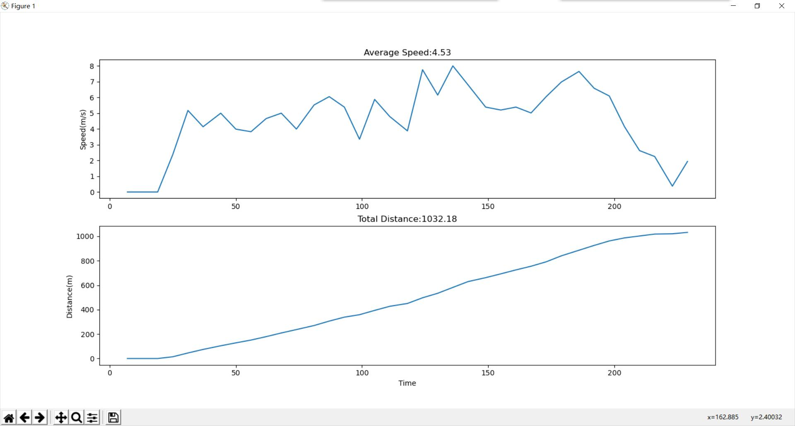
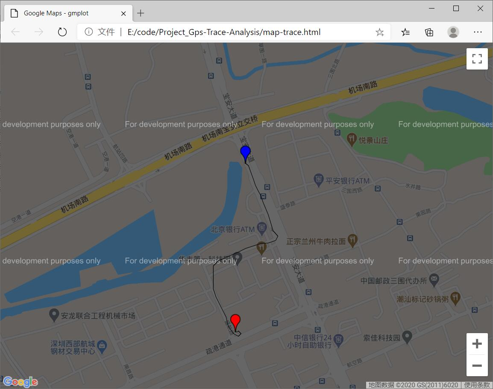

# Gps Trace Analysis

*This is a full python project*

```
/*
Version:		V1.0
Author:			Vincent
Create Date:	2020/9/2
Note:
*/
```



[toc]

# OVERVIEW


## Intruduce

[Makerfabs home page](https://www.makerfabs.com/)

[Makerfabs Wiki](https://makerfabs.com/wiki/index.php?title=Main_Page)

MakePython A9G is an IOT for GPRS / GSM + GPS module, users can use MicroPython to program it, which is very easy, especially for non-programmers. There is also a user guide to learn how to use the board to create the first IOT project, which allows beginners to quickly learn hardware and programming skills.

With this board, you will easy to add text, SMS and data to your project. It is good for your smart home project or GPS tracker and so on.

This project obtains GPS information through A9G module.Save longitude, latitude, and time on an SD card.And through a simple Python program, analysis of the information obtained.Generate a map trail and graphically analyze the speed and distance of motion.


## Equipment list

- [MakePython ESP32](https://www.makerfabs.com/makepython-esp32.html)
- [MakePython A9G GPRS/GPS Expansion](https://www.makerfabs.com/makepython-a9g-gprs-gps-shield.html)
- Micro SD Card


# STEPS

## Prepare And Burn

**If you have any questions，such as how to install the development board, how to download the code, how to install the library. Please refer to :[Makerfabs_FAQ](https://github.com/Makerfabs/Makerfabs_FAQ)**

- Connect ESP32 to PC .
- Use uPyCraft upload all file in "/Project_Gps-Trace-Analysis/workSpace/".
- Insert a micro SD card.
- Restart ESP32.
- Wait a moment ,Lcd screen will show some data.



## Let Collect Gps Data

- Connect to mobile power/lithium battery.



- Attach to the electric bike.



- Let's go for a ride.

## Analysis Data

- Copy the SD card TXT file beginning with "trace" into the project folder.
- Open file "Google_trace.py",  change file name.

```python
#File which you want analysis
trace_file_name = "./trace4.txt"
```

- Run "python google_trace.py" from the command line.
- Maybe need install some python library ,like use "pip install gmplot"
- A window containing the speed and distance will be displayed.



- And generate a map track web page file.




# Code Explain

## ESP32

### test.py

- A9G Open GPS

```python
uart.write('AT+GPS=1\r\n')  # 1: turn on GPS  0:Turn off GPS
```
- A9G Turn off timing report

```python
uart.write('AT+GPSRD=0\r\n')
```
- A9G Get location

```python
uart.write('AT+GPS=1\r\n')  # 1: turn on GPS  0:Turn off GPS
```

